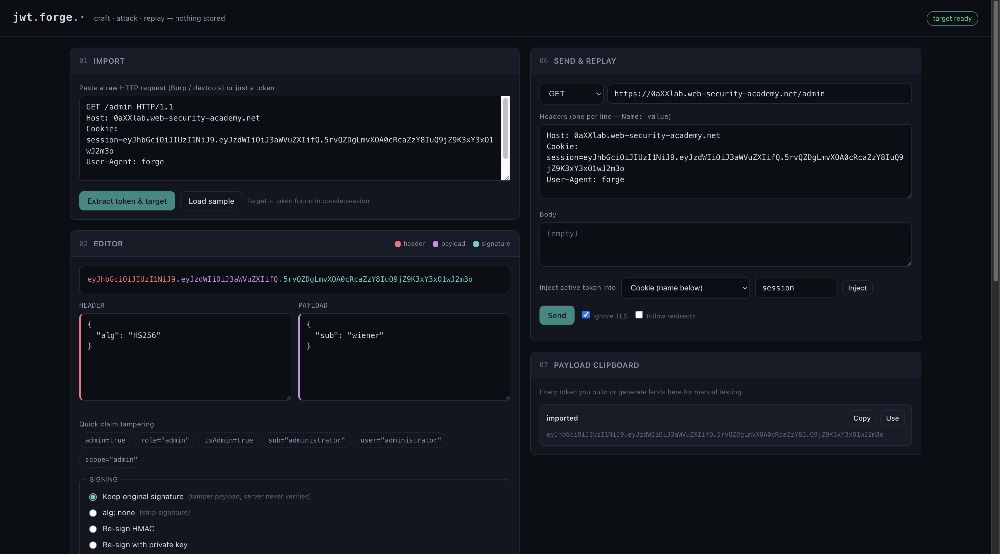

# JWT Forge

A self-hosted, web-based JWT attack workbench. Paste a request, tamper the
token, run every JWT attack at once, and replay it at the target — from one
dark, single-page UI.

Built for authorized testing: your own apps, in-scope bug-bounty targets, and
PortSwigger labs. The browser holds all state; the backend only signs tokens
and relays the request you build. **Nothing is stored, no history is kept.**




---

## Why

Most JWT CLIs re-sign every token they emit, which breaks the common real-world
case where the server *never verifies the signature* — you just need to change
a claim and resend with the original signature. JWT Forge makes that a
first-class mode, adds a builder for `jwk`/`jku`/`x5u`/`x5c` key-injection
headers, and lets you fire the whole attack set at a target in one click to see
which one lands.

## Features

- **Import** — paste a raw HTTP request (Burp / devtools) or a bare token;
  auto-extracts the token, URL, method, headers, body, and where the token lives.
- **Free JSON editing** of header and payload, with a live tri-color token strip
  showing exactly what you'll send, plus one-click privilege-escalation claims.
- **Signing modes vanilla tools skip** — keep the original signature on a
  tampered payload, `alg: none`, re-sign HMAC (any secret), or re-sign with your
  RS/PS/ES private key.
- **One-click attack catalog** — `alg:none` (4 case variants), stripped
  signature, blank secret, RS->HS algorithm confusion (both key byte-forms),
  embedded `jwk`, embedded `x5c`, `jku` injection, `x5u` injection, `kid` path
  traversal, `kid` SQL injection.
- **Key injection builder** — pick `jwk` / `x5c` / `jku` / `x5u`, and it writes
  the header, signs the token, and hands you the exact JWKS or certificate to
  host.
- **Run all against target** — sends every attack at the endpoint, baselines
  against the original token, and flags likely bypasses.
- **Weak-secret cracking** — your browser reads the wordlist and streams it to
  the backend in chunks; stops on hit.
- **Keypair / cert generation** for the injection attacks.
- **Payload clipboard** — every token you build is listed for manual copy-paste.

## Attack catalog

| Attack | What it tests |
|---|---|
| `alg: none` (none/None/NONE/nOnE) | server honours unsigned tokens |
| stripped signature, alg intact | verify-only-if-present bugs |
| tamper payload, keep signature | signature never verified |
| blank HMAC secret | empty signing key |
| algorithm confusion RS->HS | public key reused as HMAC secret |
| embedded `jwk` | server trusts the header's key (CVE-2018-0114) |
| embedded `x5c` | server trusts the header's certificate chain |
| `jku` injection | server fetches keys from your URL |
| `x5u` injection | server fetches a certificate from your URL |
| `kid` path traversal -> `/dev/null` | kid selects a key by file path |
| `kid` SQL injection | kid used in a SQL key lookup |

## Quick start

```bash
git clone https://github.com/MomoRizza/JWT-Forge.git
cd JWT-Forge
docker compose up -d --build
# -> http://localhost:8000
```

Move it to any server by copying the folder and running the same command — the
image builds from source, no registry needed.

### Without Docker

```bash
pip install -r requirements.txt
cd backend && uvicorn main:app --host 0.0.0.0 --port 8000
```

## Deploy safely

This is an attack tool — `/api/send` will send requests anywhere, so **don't
expose port 8000 to the internet.** Bind it to localhost and tunnel in:

```yaml
# docker-compose.yml
ports:
  - "127.0.0.1:8000:8000"
```

```bash
ssh -L 8000:127.0.0.1:8000 user@SERVER_IP   # browse http://localhost:8000
```

## Usage

1. **Import** a request or token (there's a *Load sample* button to try it).
2. **Edit** the payload — click a claim chip like `sub=administrator`.
3. Pick a **signing mode**. For "signature never checked" targets, choose
   *Keep original signature* and hit **Build token**.
4. Or hit **Generate all attacks**, then **Run all against target** to see which
   status codes come back.
5. For key-injection bugs, use the **Key injection builder**, host the JWKS /
   cert it gives you, and send.

## API

All endpoints are `POST` JSON, no auth, nothing persisted.

| Endpoint | Body |
|---|---|
| `/api/decode` | `{token}` |
| `/api/sign` | `{header, payload, signing}` — method in `keep/none/hmac/rsa/ec/raw` |
| `/api/attacks` | `{token, claims?, public_key?, attacker_url?}` |
| `/api/craft` | `{token, mode, url?, claims?, private_key?, alg?}` — mode in `jwk/x5c/jku/x5u` |
| `/api/crack` | `{token, wordlist:[...]}` |
| `/api/verify` | `{token, public_key?/secret?}` |
| `/api/keygen` | `{type:"rsa"/"ec", bits?, curve?}` |
| `/api/parse` | `{raw}` |
| `/api/send` | `{method, url, headers, body, insecure?, follow_redirects?}` |

## Tech

FastAPI + `cryptography` backend, single-file vanilla-JS frontend, no external
runtime JS dependencies. Token crafting is done with raw base64url + crypto
primitives (not a JWT library) so it can emit the malformed tokens attacks need.

## Disclaimer

JWT Forge is for **authorized security testing and education only.** Use it only
against systems you own or have explicit written permission to test. You are
responsible for how you use it; the authors accept no liability for misuse or
damage. See [LICENSE](LICENSE).

## Credits

Attack surface inspired by [ticarpi/jwt_tool](https://github.com/ticarpi/jwt_tool).

## License

[MIT](LICENSE) — Copyright (c) 2026 MomoRizza
